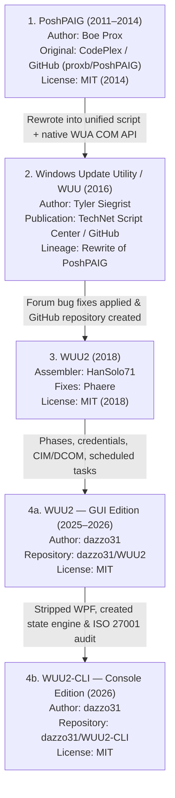

# WUU2-CLI — Provenance, Lineage, and Attribution

This document records the full development lineage of **WUU2-CLI**, tracing its origin from earlier open-source PowerShell patch management tools, documenting all copyright holders, and detailing how the codebase evolved from a monolithic graphical script into an auditable console engine.

---

## 1. Lineage Overview

WUU2-CLI is a fourth-generation derivative work:



---

## 2. Upstream Projects and Authors

### Stage 1: PoshPAIG (2011–2014)
* **Author:** Boe Prox
* **Repositories:** CodePlex (`poshpaig.codeplex.com`, archived) and GitHub ([`proxb/PoshPAIG`](https://github.com/proxb/PoshPAIG))
* **License:** The MIT License (MIT), `Copyright (c) 2014 Boe Prox`
* **Historical Context:**
  PoshPAIG (PowerShell Patch Audit/Installation GUI) was created by Boe Prox in mid-2011 to simplify Windows update management across remote servers. Featured on Microsoft’s *"Hey, Scripting Guy!"* blog in August 2011, it introduced multi-threaded background runspaces for patch auditing, host exemption lists (`Exempt.txt`), and remote patch execution.

### Stage 2: Windows Update Utility (WUU) (2016)
* **Author:** Tyler Siegrist
* **Publication:** Microsoft TechNet / Script Center (ID `1d72e520`, December 14, 2016) and GitHub ([`HashGambit97/WindowsUpdateUtility`](https://github.com/HashGambit97/WindowsUpdateUtility))
* **License:** MIT-compatible permissive release acknowledging PoshPAIG
* **Historical Context:**
  Tyler Siegrist completely re-architected PoshPAIG into a unified ~1,100-line script (`WUU.ps1`) accompanied by XAML files (`WUU.xaml`, `OUPicker.xaml`). Rather than generating temporary VBScripts as early PoshPAIG versions did, WUU interacted directly with the Windows Update Agent (WUA) COM APIs (`Microsoft.Update.Session`, `Microsoft.Update.UpdateColl`) and established the classic operational scriptblocks: `$GetUpdates`, `$DownloadUpdates`, `$InstallUpdates`, `$RestartComputer`, `$RemoveOfflineComputer`, and `$WUServiceAction`.

### Stage 3: WUU2 (2018)
* **Maintainer:** HanSolo71
* **Contributor:** Phaere (TechNet Script Center community)
* **Repository:** GitHub ([`HanSolo71/WUU2`](https://github.com/HanSolo71/WUU2))
* **License:** MIT License, `Copyright (c) 2018 HanSolo71`
* **Historical Context:**
  HanSolo71 collected community fixes posted by Phaere on the TechNet discussion forums (addressing runspace variable isolation, COM casting issues, and UI binding glitches), packaged them into a git repository, and published the project under the MIT License on October 28, 2018.

### Stage 4: WUU2 & WUU2-CLI (2025–2026)
* **Author:** dazzo31
* **Repositories:** [`dazzo31/WUU2`](https://github.com/dazzo31/WUU2) and [`dazzo31/WUU2-CLI`](https://github.com/dazzo31/WUU2-CLI)
* **License:** MIT License, `Copyright (c) 2025-2026 dazzo31`
* **Historical Context:**
  dazzo31 undertook a fundamental multi-stage re-engineering of the codebase:
  1. **Enterprise Hardening (GUI Edition):** Eliminated UI thread deadlocks, introduced 5-wave phased deployment automation, added custom credential management via DCOM CIM sessions (`[pscredential]`), replaced PsExec execution with temporary SYSTEM scheduled tasks reporting progress through the registry (`HKLM:\SOFTWARE\WUU2\Jobs`), and built the WSUS audit engine (`Audit-WSUSUpdates.ps1`).
  2. **Console & Audit Architecture (CLI Edition):** Decoupled the engine entirely from WPF/XAML, established a thread-safe synchronized state store (`Wuu.State`), designed a SHA-256 hash-chained audit logging subsystem compliant with ISO/IEC 27001:2022 A.8.15 (`Wuu.Audit`), enforced operation identity and global concurrency caps, built a scriptable command shell (`Wuu.Command`, `Wuu.Navigate`), and established comprehensive headless test and release verification gates.

---

## 3. Licensing and Legal Compliance

All source projects in this lineage are licensed under the **MIT License**.

Because the MIT License requires that the copyright notice and permission notice be preserved in all copies or substantial portions of the software, `LICENSE` preserves the complete attribution chain:

```text
Copyright (c) 2014 Boe Prox (PoshPAIG)
Copyright (c) 2016 Tyler Siegrist (Windows Update Utility)
Copyright (c) 2018 HanSolo71 (WUU2)
Copyright (c) 2025-2026 dazzo31 (WUU2 / WUU2-CLI)
```

There are no copyleft restrictions (such as GPL), proprietary software components, or viral licensing terms anywhere in the codebase.

---

## 4. Code Ancestry and Transformation Matrix

| Component / Subsystem | Ancestral Origin | Status in WUU2-CLI | Transformation Details |
| :--- | :--- | :--- | :--- |
| **Runspace collections** (`$jobs`, `$jobCleanup`, `$updatesHash`) | PoshPAIG (2014) | Refactored | Migrated from free-floating script variables into structured modules (`Wuu.Scheduler`, `Wuu.WindowsUpdate`). Dead `$uiHash` injection removed. |
| **Exemption filter** (`Exempt.txt`) | PoshPAIG (2014) | **Retired** | Silent drop mechanism and placeholder file completely retired (`WUU-OBS-02`); exclusion belongs in explicit policy rather than a silent local file check. |
| **Elevation check** | PoshPAIG (2014) | Hardened | Enforces non-interactive fail-fast paths without blocking on interactive prompts in CI/headless mode. |
| **PsExec remote execution** | PoshPAIG (2014) / WUU (2016) | **Replaced** | Completely replaced by temporary SYSTEM scheduled tasks registered over WMI/DCOM. |
| **WUA COM query engine** (`Microsoft.Update.Session`) | WUU (2016) | Evolved | Direct descendant of Tyler Siegrist's WUA COM search logic; now wrapped in hard timeout budgets and floor protections. |
| **Worker payloads** (`$GetUpdates`, `$DownloadUpdates`, `$InstallUpdates`) | WUU (2016) | Evolved | Operational bodies descend from WUU/WUU2 scriptblocks, but now funnel mutations through `Touch()`, track `OperationId`, and publish heartbeats. |
| **GUI / XAML interfaces** (`WUU.xaml`, `OUPicker.xaml`) | WUU (2016) | **Removed** | Completely removed. Replaced by terminal shell (`Wuu.Console`, `Wuu.Navigate`). |
| **Phased deployments** (5 waves) | WUU2 (2025) | Active | Controls wave progression across computer fleets. |
| **WSUS update audit** | WUU2 (2025) | Active | Implemented via `Scripts/Audit-WSUSUpdates.ps1`. |
| **DCOM CIM sessions & credentials** | WUU2 (2025) | Active | Secure credential caching and remoting without requiring WinRM listeners for update queries. |
| **State machine & funnel** (`Wuu.State`) | WUU2-CLI (2026) | **New** | Thread-safe, monotonic, identity-aware state store with invariant enforcement. |
| **Audit subsystem** (`Wuu.Audit`) | WUU2-CLI (2026) | **New** | SHA-256 hash-chained audit trail compliant with ISO/IEC 27001:2022 A.8.15. |
| **Command & guided workflow** (`Wuu.Command`, `Wuu.Navigate`) | WUU2-CLI (2026) | **New** | Scriptable command processor and interactive terminal navigation. |
| **Automated test & release harness** | WUU2-CLI (2026) | **New** | Headless regression suites (`Invoke-TestSuites.ps1`) and release validator (`Validate-Release.ps1`). |

